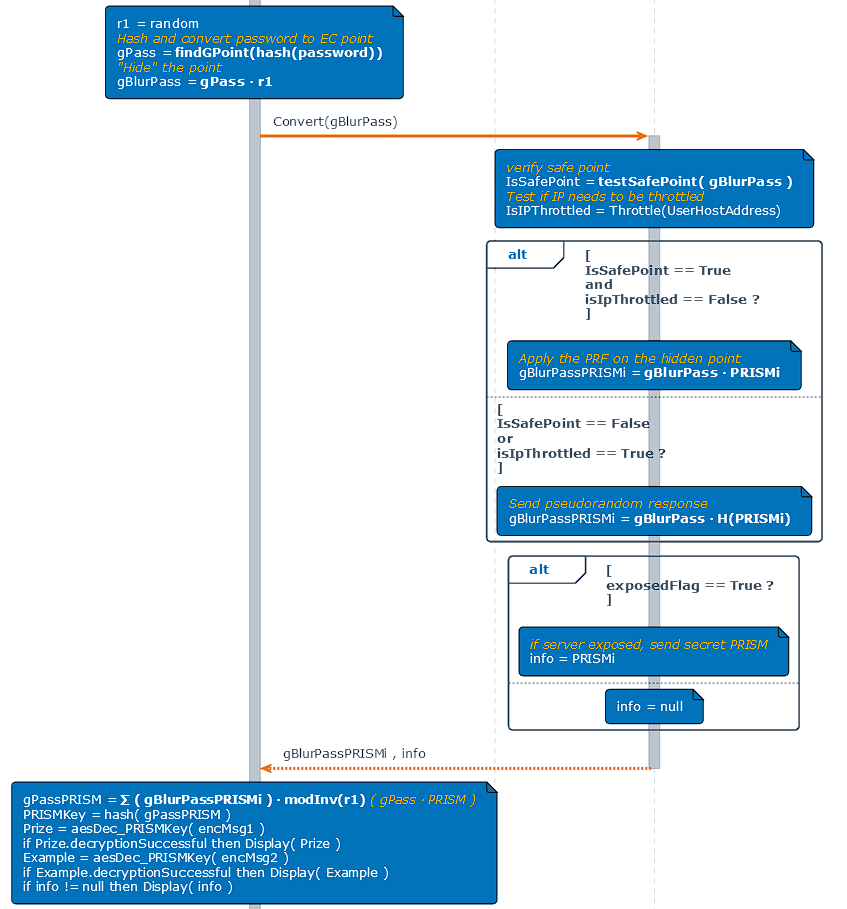
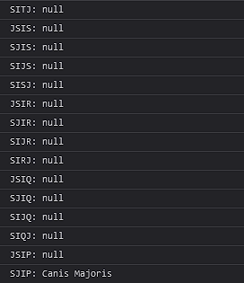

<h2>Misconfiguration - Private Prism Value Made Public</h2>

I'm sure some people noticed that the challenge was made easier by making the ork2 prism value public, which can be seen here: https://ork2.westus2.cloudapp.azure.com/prizeKey

so we have both the ork1 and ork2 prism values, meaning we can construct the authentication point from any password ourselves.
first I removed the blurring process by removing the randoms and any operations involving randoms. Refer to this schematic:



which allowed me to create consistent payloads to send to the ork nodes, and in turn receive consistent outputs back. I don't think this step was necessary, but it sure helped me debug the heck out of the inputs and outputs of ork nodes (and it probably makes brute-forcing slightly faster)

anyhow, we need to brute force the password from AAAA to ZZZZ to to see if it can crack the message
oh and the hint from twitter was "J", so I didn't need to try all 4 digits, I tried J???, ?J??, ??J?, ???J 
to brutforce, I found two methods to do it.

1. host 2 ork nodes with the corresponding prism values (which are now both public), and run the usual flow for each letter combo
2. manually calculate the Edwards Curve scalar multiplications using the prism values (simulate what the ork nodes do) completely offline. 

I found both works, but the second one is faster. The first method involves very similar methodology to @[BWN] Z3U5 's solution in the previous challenge.
Also, the first method requires you to modify throttling in your own orks. There are many ways to do this, but I modified this section of code in ApplyControllers.cs:

```
private ActionResult<string> Apply(Point toApply, BigInteger key)
        {
            try
            {
                var barredTime = 0;                       <--- was originally Throttle().Value
                if (!barredTime.Equals(0))
                    return StatusCode(429, barredTime.ToString());

                Point appliedPoint = PRISM.Apply(toApply, key);
                return appliedPoint.ToBase64();
            }
            catch (Exception ex)
            {
                return BadRequest(ex);
            }
        }
```

the script I wrote for the second method (offline method) looks like the following (I wrote it in the getRandom testing function):

```
export async function getRandom() {
  const encryptedData = ["B5nuPcC9i01Mrv7TUFFxF9La25kATdYW1gPwudhOBbN9Q7PvBalvosc="]

  for (let i = 25; i >= 0; i--) {
    var first = String.fromCharCode(65 + i)
    for (let j = 25; j >= 0; j--) {
      var second = String.fromCharCode(65 + j)
      for (let k = 25; k >= 0; k--) {
        var third = String.fromCharCode(65 + k)
        var brute_vals = ["J" + first + second + third, first + "J" + second + third, first + second + "J" + third, first + second + third + "J"]
        for (let l = 0; l < 4; l++) {
          var brute_val = brute_vals[l]
          const passwordPoint = await Point.fromString(brute_val);

          const ork1PrismVal = BigInt("5072882730088996523713909516069951556749407210189458495835260106699727451075")
          const ork1 = new Point(passwordPoint.times(ork1PrismVal).getX(), passwordPoint.times(ork1PrismVal).getY())
          const ork2PrismVal = BigInt("5700593961659722864253033845786740992226924799281009487462168678312388445069")
          const ork2 = new Point(passwordPoint.times(ork2PrismVal).getX(), passwordPoint.times(ork2PrismVal).getY())

          const authPoint = [ork1, ork2].reduce((sum, next) => sum.add(next))
          const keyToEncrypt = await SHA256_Digest(authPoint.toBase64()); // Hash the authentication point for added security
          var decrypted = null;
          var m;
          for (m = 0; m < encryptedData.length && decrypted == null; m++) {
            try {
              decrypted = await decryptData(encryptedData[m], keyToEncrypt); // Attempt to decrypt the data
            } catch {
              decrypted = null;
            }
          }

          console.log(brute_val + ": " + decrypted)
          if (decrypted != null) {
            return
          }
        }
      }
    }
  }
}
```

the for loops go through all the letter combos until hitting the one that successfully decrypts the encrypted data


