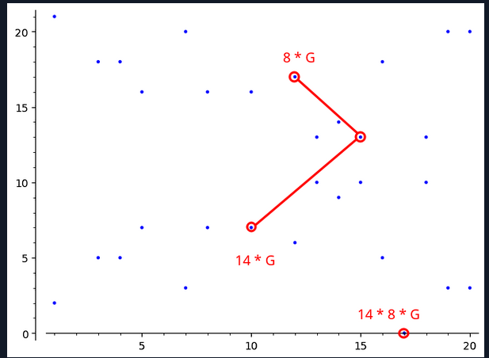
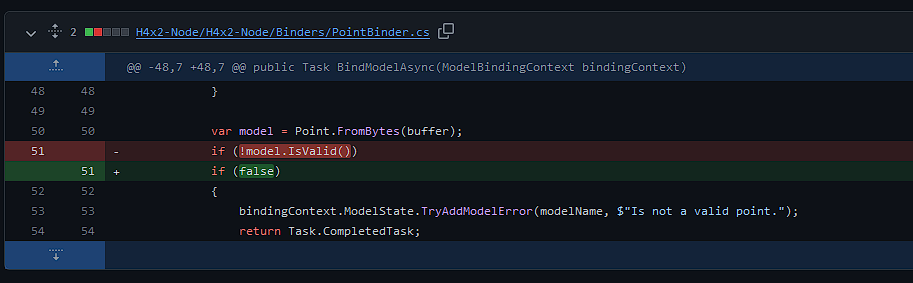
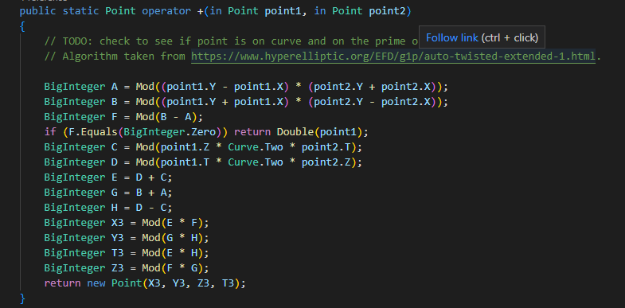
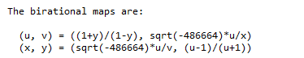

TLDR: The orks' lack of checks on input points allowed me to use an Invalid Curve Attack (ICA) to find the ork2 prism value, which then I used together with ork1 prism value to locally brute force the password as I did in previous challenges (refer to my write-up on challenge 1.2 to learn how I brute forced the password). 

<h2>General Overview of Elliptic Curve Cryptography and Its Vulnerabilities</h2>

let's talk about what Elliptic Curve Cryptography actually does for a second (https://en.wikipedia.org/wiki/Elliptic-curve_cryptography). 
Simply put, ECC can take a point A and perform a point multiplication with a secret key (i.e. prism value) s to output point B (s*A = B) over a finite field F_p 
(https://en.wikipedia.org/wiki/Finite_field). We can compute B fast if we know A and s. However, knowing only A and B, there is no way to compute s in an efficient manner. 
This problem is called the Elliptic Curve Discrete Logarithm Problem (ECDLP) and our security depends on this problem being infeasible to solve, which would be satisfied if the key is very large. 
Similarly, the security of the encryptions in the H4x challenge depend on us not being able to find both prism values; the prism values are very large so they are unguessable. 
Invalid curve attack helps us break down the ECDLP on prism value into smaller subproblems that are more feasible to compute. 
When the subproblems are solved and then combined, we can get the prism value. 

Specifically, the factors of the order of the curve are used to break down the ECDLP; 
solving the relatively easier ECDLP for each of the factors and then combining the results using a technique called Chinese Remainder Theorem can produce the original key. 
The order of a curve is the maximum number of points on the curve (https://medium.com/asecuritysite-when-bob-met-alice/whats-the-order-in-ecc-ac8a8d5439e8) 
and the order of a point is the number of points its group contains. When we are performing a scalar multiplication on a curve, 
we are essentially starting at one point and ending up in another within this specified set of points. 



For example, our ed25519 for this challenge has an order of 
57896044618658097711785492504343953926856930875039260848015607506283634007912 and cofactors 
[2^3, 7237005577332262213973186563042994240857116359379907606001950938285454250989].

What I just described (using factors of the order to break down ECDLP) is also known as a Small Subgroup Attack. You can learn more deeply about it in this fantastic article: https://azzaoui.org/2022/06/29/small-subgroup-attacks-on-weak-curves.html 


<h2>Invalid Curve Attack and Why It's Possible</h2>

Unfortunately, ed25519 is not vulnerable to a Small Subgroup attack (afaik). The reason is that there are only two cofactors: one really small and one really large. 
Finding the discrete log of the small factor (8) can only give you 3 bits of information about the key (out of like 100 or something), while finding the discrete log of the large one is impossible. 
This is where ICA shines! ICA can trick the ork into performing point multiplication on a point of low order from a different, invalid curve.
Do this multiple times for different invalid curves, and you get enough information to reconstruct the original curve's secret key (i.e. prism value) using Chinese Remainder Theorem. 
Learn more about how to performan ICA in this article (with code!): https://www.hackthebox.com/blog/business-ctf-2022-400-curves-write-up. 
This article contains most of the code (using a language called Sagemath) I used to perform my attack. 

in our challenge, ICA was possible because of two things:
Firstly, in the ork nodes, the check to enforce the validity of the input point (i.e. whether the point actually lies on ed22519) was removed. 



Secondly, the ed25519 addition formula that was implemented in the code did not use all the variables in the curve's formula (-x^2  + y^2 = 1 + d*x^2y^2) 
notice there is no mention of the variable "d" in this addition implementation.



This paper by Neves and Tibouchi discusses these topics succinctly https://ietresearch.onlinelibrary.wiley.com/doi/10.1049/iet-ifs.2017.0075

ok, so now we have a code for ICA and we know that the ork nodes are vulnerable to ICA, we can just copy and paste the code, adjust it a little bit, and run it to get the ork2 prism value right? 


<h2>Ed25519 and Curve25519</h2>

Before I go on, let me clarify something. Ed25519 refers to a Twisted Edward Curve with a prime field of 2^255 - 19. Curve25519 refers to a Montgomery Curve with a prime field of 2^255 - 19. 
I may use the terms ed25519 and Twisted Edward Curve interchangeably, but do keep in mind that Twisted Edward Curve is more like a type of Elliptic Curve, while ed25519 is a 
Twisted Edward Curve with specific parameters.

https://www.rfc-editor.org/rfc/rfc7748#section-4.1
ed25519 has the following formula: 
`-x^2 + y^2 = 1 + d*x^2*y^2,        where d = 37095705934669439343138083508754565189542113879843219016388785533085940283555`

there is a birationally equivalent form of Twisted Edward Curve called Montgomery Curve (Curve25519 in this case):
`v^2 = u^3 + A*u^2 + u,                  where A = 486662 `

I don't know what "birationally equivalent" really means, but from a lot of testing, I found out that these two curves are like twins. 
Their order is the same, and a point in one curve has a directly equivalent point on the other curve. 
Performing the same point multiplication on an equivalent pair of points results in a new equivalent pair of points on the two respective curves. So for all intents and purposes, 
these two curves are the same thing just said in different languages. 

Sagemath only supports Montgomery curves, but the orks only compute points on a Twisted Edward Curve. So I need to create functions to convert points from one curve type to another. 
The ICA script would look something like this:

create a random invalid Montgomery curve --> 
generate a point of low order --> 
convert point to twisted form --> 
send twisted point to ork and receive new twisted point --> 
convert new point back to montgomery --> 
compute the discrete log of the points using Polhig-Hellman algorithm over the invalid montgomery curve --> 
do this multiple times and combine the discrete log results using Chinese Remainder Theorem to get prism value

I now have all the pieces I need to run the ICA. 

For brevity, and because I don't understand them well, I will skip explaining the Polhig-Hellman algorithm and Chinese Remainder Theorem. 
Resources for these can be easily found on google, and are explained in some of the articles I linked above 


<h2>Exploit</h2>

The following codes were written in Sagemath (it's basically Python).
Here's how I would create a regular Curve25519:

```
p = 2^255-19
E = EllipticCurve(GF(p), [0, 486662, 0, 1, 0])
order = E.order()
```

what I wanted was to create a random invalid curve by changing the "A" parameter in v^2 = u^3 + A*u^2 + u, and also generate a point of low order from the invalid curve, 
so I created a function like this: 

```
def create_point(p=2^255-19, a1=0, a2=486662, a3=0, a4=1, a6=0):
    E = EllipticCurve(GF(p), [a1, a2, a3, a4, a6])
    order = E.order()
    factors = prime_factors(order)

    valid = []
    for factor in factors:
        if factor <= 2**35:
            valid.append(factor)
    if len(valid) == 0:
        return None, None, None
    
    prime = valid[-1]
    G = E.gen(0) \* int(order / prime)  # finds point of order "prime", which is a low order

    return prime, E, G
```

Next, these are the functions I used to convert the points from one curve to another:

```
# (u, v) = ((1+y)/(1-y), sqrt(-486664)*u/x)
def twisted_to_montg(p, x, y, d=-486664):
    gf=GF(p)
    X_P = gf(x)
    Y_P = gf(y)
    u = (1+Y_P)/(1-Y_P) 
    v = gf(d).sqrt()*u/X_P
    return (u, v)

# (x, y) = (sqrt(-486664)*u/v, (u-1)/(u+1))
def montg_to_twisted(p, u, v, d=-486664):
    gf=GF(p)
    x = gf(d).sqrt()*u/v
    y = (u-1)/(u+1)
    X_P = gf(x)
    Y_P = gf(y)
    return X_P, Y_P
```

from https://www.rfc-editor.org/rfc/rfc7748#section-4.1


And this function is used to convert a montgomery point to twisted, send it to the ork, and convert the received twisted point back to montgomery:

```
import requests

# input: point on montgomery curve.
# output: point received after multiplication by prism value on an ork, converted to montgomery form.

def send_point(G, url, d=-486664):
    G_twist = montg_to_twisted(p, G[0], G[1], d)
    package = pack(G_twist[0], G_twist[1])

    # send package to the appropriate url
    payload={'point': package}
    response = requests.request("POST", url, data=payload)
    receive = response.text
    P_twist = unpack(receive)
    P = twisted_to_montg(p, P_twist[0], P_twist[1], d)
    return P
```

putting it all together, here's the exploit (some functions are not explained for brevity). looping 30 times was not enough to get the full prism value, so I did 42:

```
import time

p = 2^255-19
dlogs = []
primes = []
for i in range(42):
    print("------", i+1, "------")
    b = randint(1, 4444444)
    d = -b - 2
    prime, E, G = create_point(a2=b)
    if prime == None:
        continue
    
    try:
        P = send_point(G.xy(), "https://ork2.westus2.cloudapp.azure.com/Apply/Prism", d=d)
    except:
        continue
    log = compute_discrete_log(E, G, P)
    if log != None:
        dlogs.append(log)
        primes.append(prime)
    time.sleep(20)  # avoid triggering throttle on the ork
print(dlogs)
print(primes)

n = crt(dlogs, primes)
print("prize:", n)
```

It took about 40 to 60 minutes to run. After I got an ork 2 prism value, I confirmed it is the correct one by decrypting the example message using password "AAAAA". 
Then I proceeded to brute force the password on the challenge message.

My repo for this attack can be found in https://github.com/AgeOfAlgorithms/Invalid-Curve-Attack-on-ed25519
