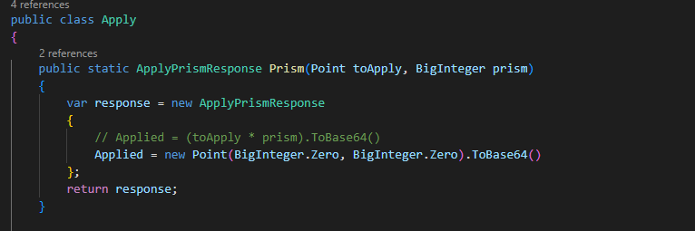

<h2>Dead Ork Hack</h2>

This is a simple and clean protocol hack! Let's understand the sign-up process first.
when a user signs up, first thing that happens is the password is mixed with a random number to create passPoint_r. This passPoint_r is passed to the three orks that are specified by the user. Each ork receives passPoint_r and then scalar multiplies it by a new random Prism value (prismi) to create appliedPoint_r.

`appliedPoint_r_i = passPoint_r * prismi`
 
appliedPoint_r from each ork are sent back to the enclave, where keyPoint_r is generated by scalar addition of all the appliedPoint_r's

`keyPoint_r = appliedPoint_r_1 + appliedPoint_r_2 + appliedPoint_r_3`

and then the enclave removes the random r from keyPoint_r using inverse mod operation. Then prismPub is created like this:

`prismPub = G * hash(keyPoint)`

prismPub is the value that is sent to orks to create the prismAuth which is then stored in the orks. Authentication (sign-in) requires that the prismAuths constructed from user's attempted password match the prismAuths stored in the orks. 
In my hack, no matter what password one puts in, prismPub collapses to a consistent value in both sign-up and sign-in processes 

this is done by using what I call a "dead point". I reprogrammed the orks (called deadOrks) to output an appliedPoint_r of (0,0), which is equivalent to (0,0,1,0), for its Apply/Prism endpoint. 

Fun fact: 

`(0,0,1,0) + any_point = (0,0,0,0)`

`(0,0,0,0) + any_point = (0,0,0,0)`

but 

`any_point + (0,0,1,0) != (0,0,0,0)`
 
It just happens that this is true given the scalar addition and multiplication implementations of this challenge's code.

so in the condition that my any of my deadOrks is selected first in the sign-up process, any password value will create a keyPoint_r of (0,0,0,0), hence creating a consistent prismPub 

the code change I applied on my ork is in ...\H4x2-Node\H4x2-Node\Flows\Apply.cs: 

