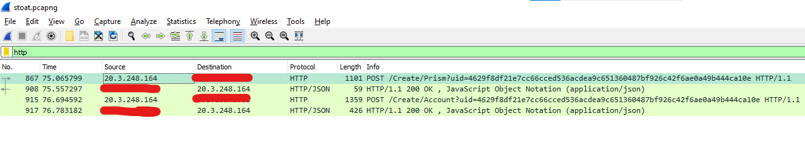
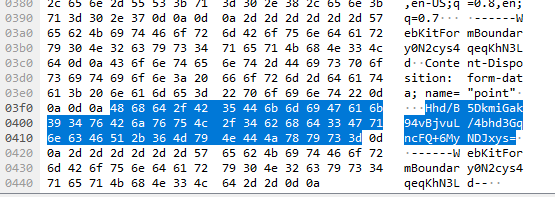
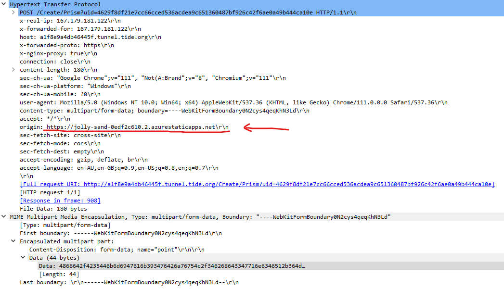
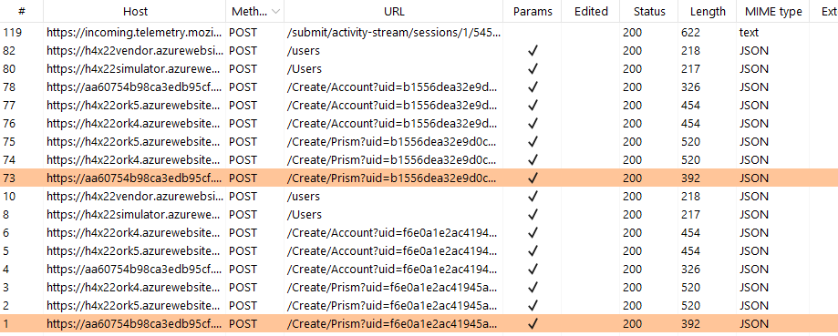
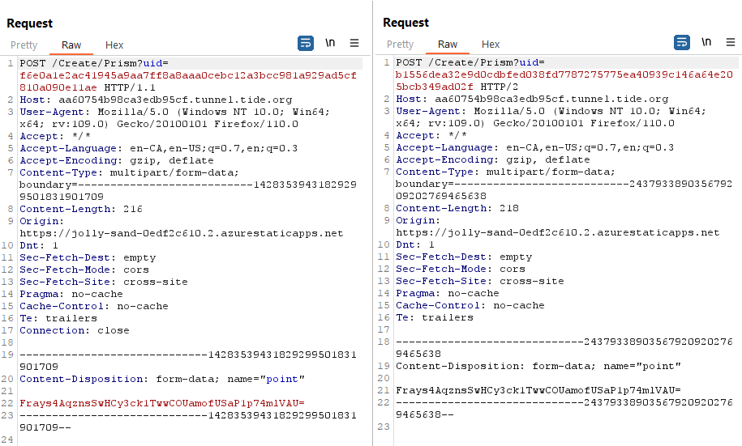
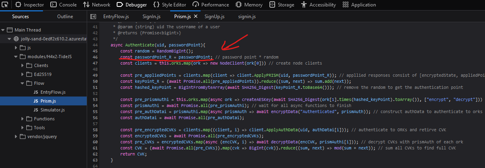

<h2>Rogue Enclave Website</h2>

TLDR: My ork's network traffic showed the enclave website that was used for sign up. That enclave had a bug where the password was not combined with a random value before being sent to orks. 
Since I captured the received hashed passwordPoint value during sign-up, I could try hashing every 4-letter password combo to see if it generates the same value as the captured hashed point 

Since the signup process is entirely controlled by the devs, we cannot capture outgoing traffic from the enclaves they use. 
In fact, we have no idea what enclave they use (yet). But we can capture traffic that is incoming to our orks. Hence as @Hulio suggested, I used wireshark to capture incoming HTTP traffic to my orks. 

Sign up process makes 2 requests to each ork: 

1. Create/Prism request, which creates a random prism value associated with the uid, and combines it with the given passwordPoint.
2. Create/Account request, which, among other things, creates a cvk value associated with the uid as well as saving uid, prism, cvk, prismauth values in a database.

each request got responded to. So that makes up the 4 items in this captured traffic list. Nothing strange here. 

Let's focus on the Create/Prism request. Looking into the form data, there seemed to be nothing out of place, either. The request data contained the passwordPoint in Base64, which was expected. 

In the headers, I obtained a crucial information. It contained the enclave website that was used by @AlphegA to sign me up.

Isn't it strange that AlphegA is not using one of the Tide orks' websites (as opposed to previous rounds)? I decided to investigate. The jolly-sand enclave website looked exactly the same as any other. So I experimented. 

Using the jolly-sand enclave, I created 2 new accounts called "111" and "112", both with password "1", and I captured the outgoing traffic using burpsuite. I then compared the traffic generated from creating the two accounts.

Below are the headers and form data of the generated http requests, side by side. I noticed something strange. 

the base64 passwordPoint values (name="point") are the same in both requests. 
The correct code would have combined the passwordPoint with randomly generated big ints before sending them to the orks, which would have resulted in two completely different values. 

I confirmed my suspicion by checking the source code using the browser's inspect function.

Absence of randomization means that my ork received the raw hashed passwordPoint value (in base64 form) from the bugged enclave in Create/Prism request. 
This allowed me to brute force the password by comparing every possible hashed 4-letter combo with the received data "Hhd/B5DkmiGak94vBjvuL/4bhd3GqncFQ+6MyNDJxys=". 
